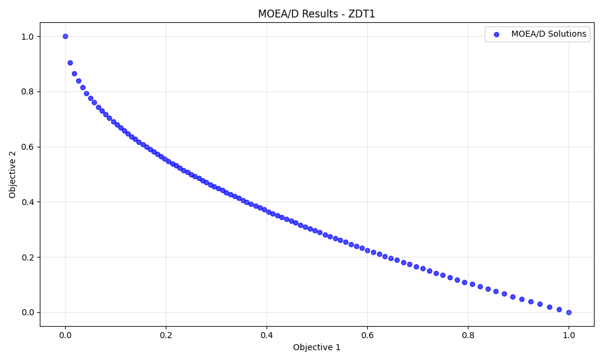

# MOEA/D: Multiobjective Evolutionary Algorithm based on Decomposition


A comprehensive Python implementation of **MOEA/D** (Multiobjective Evolutionary Algorithm based on Decomposition), a state-of-the-art algorithm for solving multiobjective optimization problems. This implementation is based on the seminal work by Zhang and Li (2007).

## 🧠 What is MOEA/D?

### The Challenge of Multiobjective Optimization

In real-world problems, we often need to optimize multiple conflicting objectives simultaneously:
- **Engineering Design**: Minimize cost vs. maximize performance
- **Portfolio Optimization**: Maximize return vs. minimize risk  
- **Machine Learning**: Minimize error vs. minimize complexity

Unlike single-objective optimization, there's no single "best" solution. Instead, we seek a **Pareto front** - a set of trade-off solutions where improving one objective requires worsening another.

### MOEA/D's Innovation

Traditional algorithms like NSGA-II tackle multiobjective problems directly using dominance relationships. **MOEA/D takes a different approach**:

> 🔄 **Key Insight**: Decompose the complex multiobjective problem into many simpler single-objective subproblems and solve them cooperatively.

**Think of it as teamwork**: Each "specialist" (subproblem) focuses on one region of the Pareto front, while sharing information with neighboring specialists to collectively cover the entire front efficiently.

### Why MOEA/D?

✅ **Computationally Efficient**: Lower complexity than dominance-based methods  
✅ **Natural Diversity**: Weight vectors ensure uniform distribution along Pareto front  
✅ **Scalable**: Handles 2, 3, or many objectives effectively  
✅ **Flexible**: Easy to integrate different decomposition methods  
✅ **Proven Performance**: Extensively validated in literature  

## 🏗️ Project Structure

```
MOEA-D in Python/
├── moead.py              # Core MOEA/D algorithm implementation
├── test_problems.py      # Standard benchmark functions (ZDT, DTLZ, etc.)
├── example.py            # Simple interface function + problem solver
├── images/               # Example results and visualizations
│   └── moead_result_for_zdt1.png
├── requirements.txt      # Required Python packages
├── LICENSE              # MIT License
├── .gitignore           # Git ignore patterns
└── README.md            # This file
```

### Core Components

- **`MOEAD` class**: Main algorithm with customizable parameters
- **Decomposition methods**: Weighted Sum and Tchebycheff approaches
- **Evolutionary operators**: Simulated Binary Crossover (SBX) and Polynomial Mutation
- **Test suite**: Standard problems for benchmarking and validation
- **Simple interface**: Easy-to-use functions for quick problem solving

## 🚀 Quick Start

### Installation

```bash
# Clone or download the project files
# Install dependencies
pip install -r requirements.txt
```

**Requirements**: `numpy`, `scipy`, `matplotlib`

### 30-Second Example

```python
from example import run_moead_simple
from test_problems import TestProblems

# Solve ZDT1 benchmark problem
results = run_moead_simple(
    objective_function=TestProblems.zdt1,
    n_objectives=2,
    n_variables=10,
    bounds=[(0, 1)] * 10,
    population_size=100,
    max_generations=200,
    plot_title="ZDT1 Pareto Front"
)

# Results automatically plotted and returned
print(f"Found {len(results['objectives'])} Pareto optimal solutions!")
```

**Example Output:**



*MOEA/D finds a well-distributed approximation of the ZDT1 Pareto front*

### For Your Custom Problem

```python
import numpy as np
from example import run_moead_simple

# Define your multiobjective function
def my_problem(x):
    """Example: Portfolio optimization"""
    f1 = np.sum(x**2)                    # Risk (minimize)
    f2 = -np.sum(x * np.arange(1, len(x)+1))  # Return (maximize, so negate)
    return np.array([f1, f2])

# Solve it!
results = run_moead_simple(
    objective_function=my_problem,
    n_objectives=2,
    n_variables=5,
    bounds=[(-2, 2)] * 5,
    plot_title="Portfolio Optimization"
)
```

## 📊 Algorithm Details

### Decomposition Methods

MOEA/D transforms the multiobjective problem using one of these approaches:

#### 1. **Weighted Sum** 

$$g^{ws}(x|\lambda) = \sum_{i=1}^{m} \lambda_i f_i(x)$$

- **Pros**: Simple, fast
- **Cons**: Cannot find solutions on non-convex Pareto fronts
- **Use when**: Pareto front is known to be convex

#### 2. **Tchebycheff (Recommended)**

$$g^{te}(x|\lambda, z^{*}) = \max_i {\lambda_i |f_i(x) - z_i^{*}|}$$

- **Pros**: Handles any Pareto front shape (convex, non-convex, disconnected)
- **Cons**: Slightly more complex
- **Use when**: General-purpose optimization (default choice)

### Algorithm Flow

1. **🎯 Decomposition**: Create $N$ uniformly distributed weight vectors $\lambda^1, \lambda^2, \ldots, \lambda^N$
2. **🏘️ Neighborhoods**: Group similar weight vectors as "neighbors"  
3. **🔄 Evolution**: For each generation:
   - Select parents from neighborhood
   - Create offspring via crossover & mutation
   - Update neighboring solutions if offspring improves them
4. **📈 Result**: Final population approximates the Pareto front

### Key Parameters

| Parameter | Description | Typical Values |
|-----------|-------------|----------------|
| `population_size` | Number of subproblems ($N$) | $50\text{-}100$ (2 obj), $100\text{-}200$ (3+ obj) |
| `max_generations` | Evolution iterations | $200\text{-}500$ |
| `decomposition` | Decomposition method | `'tchebycheff'` (recommended) |
| `neighborhood_size` | Cooperating subproblems ($T$) | $20$ (default) |
| `crossover_rate` | SBX probability ($p_c$) | $0.9$ (default) |
| `mutation_rate` | Polynomial mutation prob. ($p_m$) | $0.1$ (default) |

## 🛠️ Usage Examples

### Method 1: Simple Interface (Recommended)

```python
from example import run_moead_simple
import numpy as np

def engineering_design(x):
    """Minimize weight and maximize strength"""
    weight = np.sum(x**2)
    strength = -np.prod(x)  # Negative because we maximize
    return np.array([weight, strength])

results = run_moead_simple(
    objective_function=engineering_design,
    n_objectives=2,
    n_variables=4,
    bounds=[(0.1, 2.0)] * 4,
    population_size=100,
    max_generations=300,
    decomposition='tchebycheff',
    plot_title="Engineering Design Trade-off"
)

# Access results
pareto_front = results['objectives']
pareto_solutions = results['population']
```

### Method 2: Direct API Usage

```python
from moead import MOEAD
import numpy as np

def my_function(x):
    return np.array([x[0]**2, (x[0]-2)**2])

# Configure algorithm
moead = MOEAD(
    n_objectives=2,
    n_variables=1,
    population_size=50,
    bounds=[(-5, 5)],
    decomposition='tchebycheff'
)

# Run optimization
population, objectives = moead.optimize(my_function, max_generations=100)
```

### Method 3: Benchmark Testing

```python
from test_problems import TestProblems
from example import run_moead_simple

# Test on standard problems
problems = ['zdt1', 'zdt2', 'zdt3']

for prob_name in problems:
    problem_func = TestProblems.get_problem(prob_name)
    
    results = run_moead_simple(
        objective_function=problem_func,
        n_objectives=2,
        n_variables=10,
        bounds=[(0, 1)] * 10,
        plot_title=f"MOEA/D on {prob_name.upper()}"
    )
    
    print(f"{prob_name}: {len(results['objectives'])} solutions found")
```

## 📚 Included Test Problems

| Problem | Objectives | Variables | Pareto Front Characteristics |
|---------|------------|-----------|------------------------------|
| **ZDT1** | 2 | 10 | Convex: $f_2 = 1 - \sqrt{f_1}$ |
| **ZDT2** | 2 | 10 | Non-convex: $f_2 = 1 - f_1^2$ |
| **ZDT3** | 2 | 10 | Disconnected with gaps |
| **DTLZ1** | 3+ | 7+ | $m$-dimensional linear simplex |
| **Schaffer** | 2 | 1 | Simple convex for quick testing |

These problems are extensively used in multiobjective optimization research for benchmarking algorithms.

## 🔧 Customization & Tips

### For Better Results

1. **Choose the right decomposition**:
   - Use `'tchebycheff'` for unknown or complex Pareto fronts
   - Use `'weighted_sum'` only if you know the front is convex

2. **Scale your problem appropriately**:
   - Population size: 50-100 for 2 objectives, 100-200 for 3+ objectives
   - Generations: Start with 200, increase if convergence is poor

3. **Normalize objectives if scales differ greatly**:
   ```python
   def normalized_objectives(x):
       f1 = objective1(x) / 1000  # Scale down large values
       f2 = objective2(x) * 100   # Scale up small values
       return np.array([f1, f2])
   ```

### Common Issues & Solutions

| Issue | Solution |
|-------|----------|
| Poor convergence | Increase `max_generations` or `population_size` |
| Uneven distribution | Use `decomposition='tchebycheff'` |
| Slow performance | Reduce `population_size` or use `'weighted_sum'` |
| Memory issues | Reduce `population_size` |

## 📖 Learning More

- **Zhang & Li (2007)**: Original paper - "MOEA/D: A multiobjective evolutionary algorithm based on decomposition"
- **Examples in code**: Run `example.py` for comprehensive demonstrations

## 📄 License

MIT License - Feel free to use in your research and projects.

See `LICENSE` file for full details.
